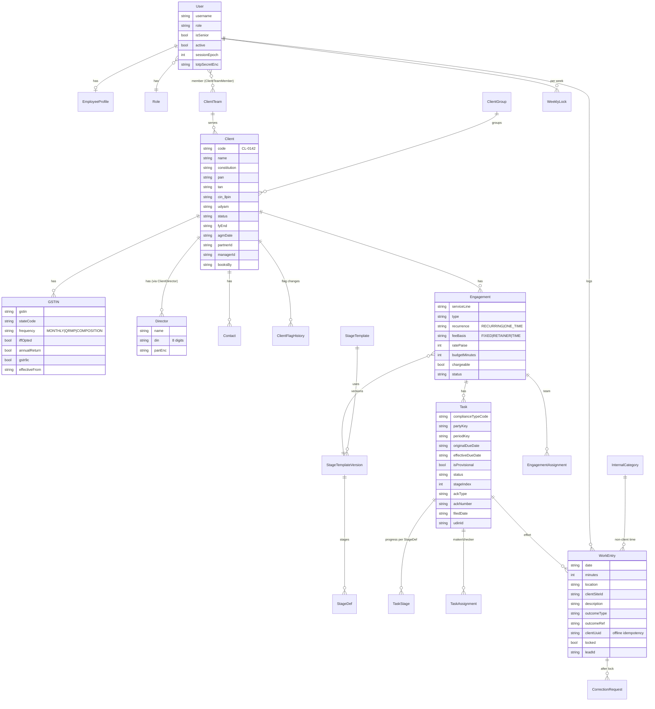
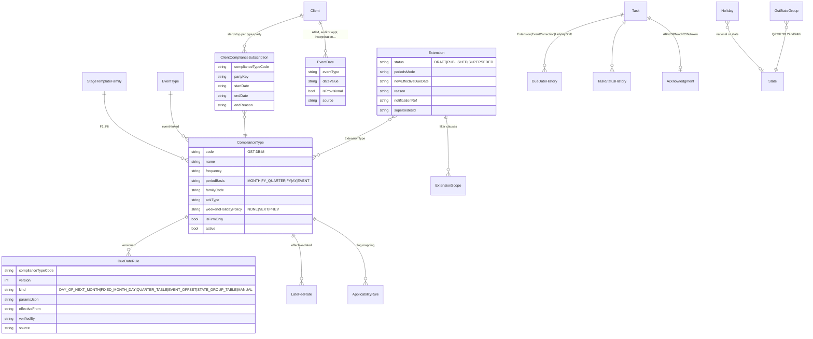
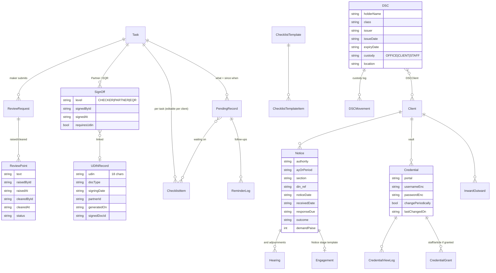
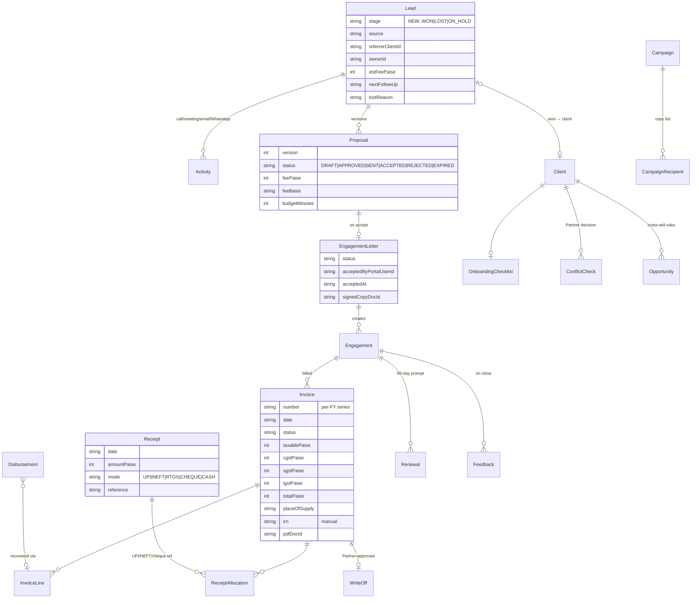
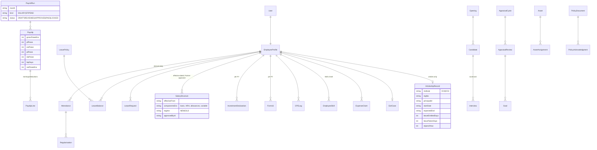
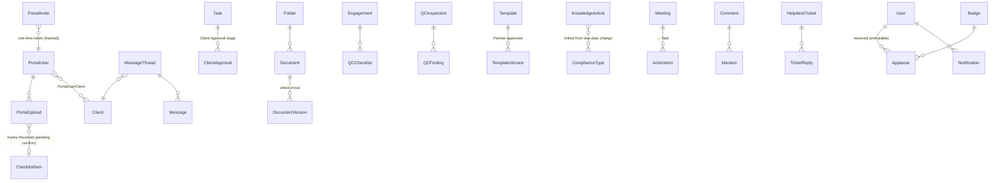

# QEPEX India Work Tracker — Data Model (Phase 0, for approval)

Status: **FROZEN at the end of Phase 1** (migration `20261006144742_init_frozen_phase1`, 181 tables in
`prisma/schema/*.prisma`). The schema is the source of truth; this page is the readable overview
(spec §14.1). Later phases add rows and
seed data, not structural changes; any structural change after freeze needs an
explicit change request and an additive migration.

## Conventions (apply to every table)

- `id String @id @default(cuid())`
- `createdAt`, `updatedAt`, `createdById`, `updatedById` on every table (system jobs use the `SYSTEM` user).
- Money: `Int` **paise** (`amountPaise`). Hours: `Int` **minutes** (`minutes`, multiple of 15).
- Business dates (due dates, entry dates, leave dates): `String` `YYYY-MM-DD` in IST. Timestamps: `DateTime` UTC.
- Status/enum fields: `String`, validated by Zod against `as const` unions (portable SQLite ↔ PostgreSQL).
- Encrypted fields end in `Enc` (`passwordEnc`, `basicPaiseEnc`…) and hold `v1:iv:tag:ciphertext`.
- Effective-dated tables carry `effectiveFrom` (and optional `effectiveTo`), `source`, `notificationRef`, `verifiedBy`, `verifiedAt`.
- Soft delete only where the spec asks for archive (`archivedAt`); audit tables are append-only.

## 1. Core (clients, people, engagements, tasks, work)

Additional core tables: `Role` (seeded 7 rows), `Designation` (+ `CostRate` effective-dated, Partner/HR only),
`ClientTeamMember`, `ClientDirector` (a director can sit on several client companies — DIR-3 KYC is one task per director, held on `Director.primaryClientId`), `ClientPtRegistration` (client × PT state, registration no., frequency; only states with `State.ptLevied`),
`ClientAssignment` (Partner/Manager/primary contact), `EngagementAssignment`, `TaskAssignment`
(`role: MAKER|CHECKER|EQR`), `EngagementBudgetPeriod` (per-period budgets for recurring work),
`InternalCategory` (seeded: Internal Meeting, Training & CPE, Articleship Classes / Exam Leave,
Practice Administration, Business Development, Knowledge Updates, Leave, Other; `chargeable` flag),
`DescriptionChip`, `RecentPair` (materialised per user for one-tap entry), `WorkTimer`,
`WeeklyLock`, `LockExtension`, `CorrectionRequest`, `UserLocationPolicy` (P1-17).

## 2. Compliance engine

Notes
- `DueDateRule.paramsJson` is a `String` holding validated JSON (e.g. `{ "day": 20, "monthOffset": 1, "marchOverride": "04-30" }`),
  parsed by Zod per `kind`. This keeps "no hard-coded statutory values": every date in the Rules Spec §10 is a seeded row.
- `ApplicabilityFlag` (from the brief) = the flag catalogue (`code`, label, "Applies when" plain-language text, P2-23)
  and `ApplicabilityRule` = the Rules Spec §1.2 mapping rows, both admin-editable.
- Additional: `State` (code, name, `ptLevied` — true for the 19 states/UTs listed in open-questions Q-02), `GstStateGroup`, `ProfessionalTaxRule` (state-specific due rule, Q-02), `JobRun`.

## 3. Review, pending-from-client, registers

## 4. Billing and CRM

Additional: `InvoiceSeries` (prefix, FY, next number), `FirmProfile` (GSTIN, bank/UPI text, SAC defaults),
`PaymentReminderLog` (copy-message "Mark as sent"), `ServiceTemplate` (proposal scope templates).

## 5. HRMS

Statutory parameter tables (admin-editable, effective-dated, each with `source` and `verifiedBy`):
`PfRate`, `EsiRate`, `ProfessionalTaxSlab` (state, wage band, amount, month override),
`IncomeTaxSlab` (FY, regime, band, rate), `TaxParameter` (standard deduction, rebate, surcharge bands, cess),
`StipendMinimum` (institute, location class, year of training), `CpeRequirement` (institute, member class, block),
`ConveyanceRate`, `LwfRate` (only if Q-09 says yes).

## 6. Portal, documents and other modules

Additional: `DocumentTag`, `DocumentSearchToken` (portable full-text index, D-11), `AuditFileSection`,
`IndependenceDeclaration`, `PeerReviewPack`, `RetentionRule`, `PurgeRequest`, `FAQ`, `NotificationPreference`
(quiet hours; overdue escalations cannot be muted), `ClientReminderSchedule`, `ClientReminderDue`.

## 7. System

`AuditLog` (entity, entityId, action, beforeJson, afterJson, actorId, reason, at, lockState),
`SensitiveViewLog` (actorId, kind CREDENTIAL|FINANCIALS|NOTICE|SALARY|BILLING, entityId, at, ip),
`ImportJob` (+ `ImportRow` with validation errors), `ExportJob`, `Setting` (key, valueJson, effectiveFrom),
`BackupRecord` (file, size, sha256, kind AUTO|MANUAL|PRE_RESTORE, restoreRequestedBy, approvedBy),
`JobRun`, `LoginAttempt`, `SystemLogIndex` (optional pointer into rotated log files).

## 8. Entity count and Phase 1 additions

181 tables, all created in Phase 1 (empty where the module comes later), split by domain:
`core.prisma` (37), `compliance.prisma` (35, incl. review, pending, registers), `billing-crm.prisma` (21),
`hr.prisma` (43), `portal-other.prisma` (45).

Added while writing the schema (beyond the design above): `UserSession` (server-side sessions, D-09),
`LoginAttempt`, `StageMapping` (template version moves, P2-24), `ClientPtRegistration` (Q-02),
`EmployeeOnboardingItem`, `TrainingSession`/`TrainingAttendance`, `ExitChecklistItem`, `InvestmentProof`,
`MessageThreadParticipant` (removed at offboarding), `MeetingAttendee`, `KnowledgeArticleLink`, `QCInspectionSample`,
`OnboardingItem`, `PendingRecordItem`, `ExtensionType`, `ExtensionScope`, `ReceiptAllocation`, `CampaignRecipient`.

**Change control after the freeze:** additive migrations only (new nullable columns, new tables, new indexes).
`tests/migration` fails the build if a later migration drops a table/column or deletes rows without an explicit
`-- allow-destructive: <reason>` marker, or if `schema.prisma` drifts from the migrations.
